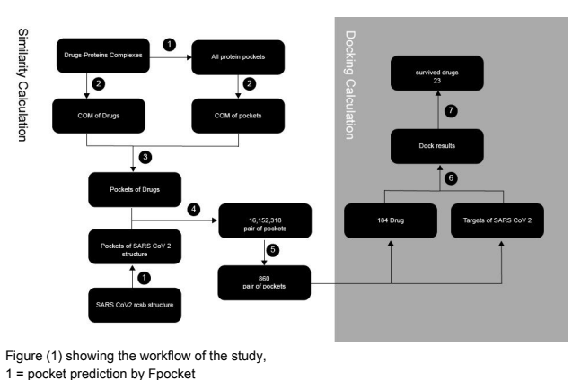
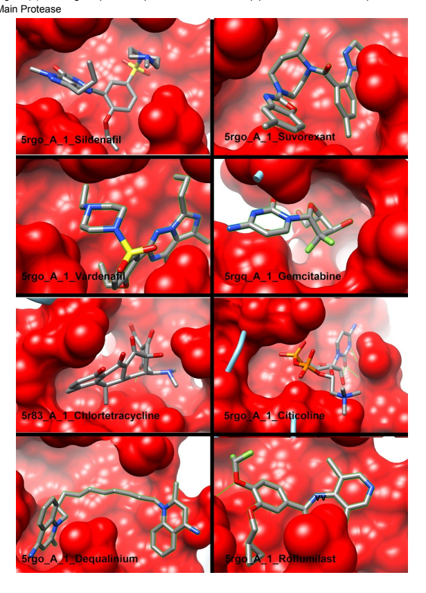
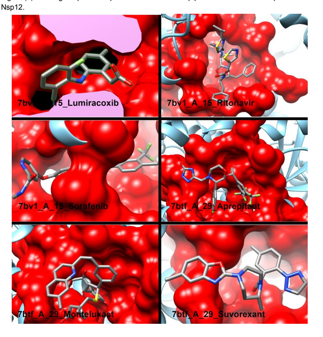
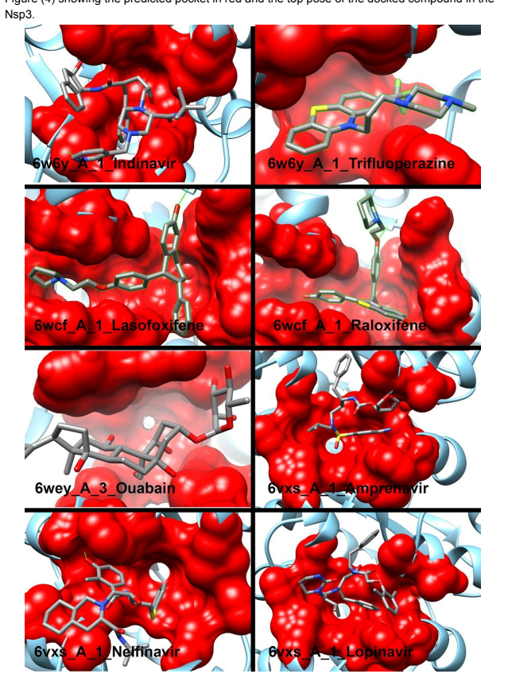

## Covid19 Approved Drug Repurposing: Pocket Similarity Approach Abstract:

SARS CoV 2 has spread worldwide and caused a major outbreak of coronavirus disease 2019 (COVID-19). To date, no licensed drug or a vaccine is available against COVID19. Starting from all of the resolved SARS CoV2 crystal structures, this study aims to find inhibitors for all of the SARS CoV2 proteins. To achieve this, I used PocketMatch to test the similarity of approved drugs binding sites against all of the binding sites found on SARS CoV 2 proteins. After that docking was used to confirm the results. I found drugs that inhibit the main protease, Nsp12 and Nsp3. The discovered drugs are either in clinical trials (Sildenafil, Lopinavir, Ritonavir) or have in vitro antiviral activity (Nelfinavir, Indinavir, Amprenavir, depiqulinum , Gemcitabine, Raltitrexed, Aprepitant, *montelukast,* Ouabain, Raloxifene) whether against SARS CoV 2 or other viruses. In addition to this, further analysis of pockets revealed a steroidal pocket that might open the door to hypotheses on why the mortality of men is higher than women. Many of the in silico repurposing studies test binding of the compound to the target using docking. The significance of this study adds to the similarity between the drug binding site and the target binding site. This takes into consideration the dynamic behaviour of the pocket after ligand binding. Keywords: pocket, docking, PocketMatch, drug design.

## Introduction:

According to the WHO, the number of infected has reached 14,043,176 and the number of confirmed dead is 597,583 as of July 19. And to date there is no licensed drug or vaccine available against COVID19. This pandemic unleashes an economic crisis affecting all income levels, this makes quarantine an intolerable option, now a drug is needed more than ever. Drug repurposing: it's a drug discovery approach that investigates the use of a drug in a way not intended by its original patent, and this has a couple of advantages first the approved drug has less chances of falling from a safety point of view because it already passed many of the clinical studies; second drug repurposing costs less because you only test for its efficacy, In addition to that many of the formulation and pharmaceutical study has already been done; third the time to repurpose a drug is substantially less; finally drug repurposing allows researchers to investigate new target and new pathways as you will see in this study. The aim of this study is to find a potential inhibitor for all of SARS CoV 2 resolved proteins. To achieve this, I extracted all of the binding sites of these resolve structures, then used a pocket similarity approach to find potential inhibitors from approved drugs followed by docking of these drugs as a confirmation step. Many of the in silico repurposing studies use docking methods[1][2] [3][3,4][5], and if the author have access to more computational power a Molecular Dynamic will follow to conform his results[6] [7][7–9], but if you think about it this is not quite a drug repurposing method, because what a docking algorithm really answers is what is the best conformation of this drug that fit into this protein? and in many cases, this drug happens to be a complex compound with many atoms and rotatable bonds that gave the compound enormous number of conformations and the probability of one of these confirmations to have a good fit is therefore higher. The significance of pocket similarity is that similar pocket will have similar conformational changes after ligand binding. This ensures the same effect of the drug on the predicted similar pocket. Up to the author's knowledge, this is the first study that uses pocket similarity to identify potential drugs for COVID 19, but it has been done before on Tuberculosis(not exactly the same method)[10].

2 = center of mass calculation COM = center of mass 3 = taking the smallest distance between the drug and the pocket 4 = Pocket comparison by PocketMatch 5 = filters (0.6 cut off, human proteins) 6 = Docking using Swissdock 7 = filters (dG of the pose < -8.0, the pose have to be the top solution predicted, the pose has to be on the site predicted by PocketMatch

## Method: Similarity Calculation:

Drug-protein complex preparation: All of the approved drugs were obtained from drugbank.ca, then the HET code of these drugs was obtained from http://ligand-expo.rcsb.org/. The list of HET codes was used to search on RCSB pdb, excluding the compound that appeared on more than 100 per structure because most of them are either small or not specific. A total of 4400 structures were retrieved from the RCSB database. After which all the pdbs were fed to a python script to clean the pdbs and leave only the drug and the chain that it binds to, the python script was designed to get all drugs even if they are in a single pdb structure and separate them in different pdbs. After which this list of pdb files was fed to Fpocket[11] to acquire the pockets of all the pdbs. Another python script which calculates pockets Center of mass. Also, the center of masses of each drug was calculated. After that, the distance between the Center of mass of the pocket and Center of mass of the drug was calculated to output a list of distances between the drug and all of the pockets of the protein.

Then the smallest distance was chosen and the pocket that corresponds to this distance was output as a pdb file, doing this to all the drugs to obtain a list of all of the pockets of the drugs.

## Covid-19 Pockets **Preparation:**

All of the pdbs of COVID-19 were retrieved from RCSB and their chains are separated into different pdbs using a python script. After that, the pdbs were feed to Fpocket. Then all of the pockets predicted by Fpocket were output into pdbs containing the aminoacid predicted by Fpocket using another python script.

## Pocket **Comparison:**

The list of the pockets of the drugs and the pockets of COVID-19 were feed to PocketMatch[12] algorithm which works by representing each Binding site by a 90 list of sorted distances capturing the shape and chemical nature of the pocket, the sorted arrays are then aligned using an incremental alignment method and score them obtain PMscore for a pair of pockets. This algorithm is fast and only takes 1/125 for a single comparison. The calculation carried on a Linux virtual machine (4GB ram and single processor 14GB disc space), and due to the limited computational power, the similarity calculation was separated into 3 batches. PocketMatch gave two similarity measures Pmin and Pmax. In this study, Pmax was used which takes the global similarity into account and it's more strict. Pmin was ignored as the PocketMatch created said: "it's too optimistic".

## Docking Calculation:

Docking of the drug with similar pockets: The drugs that their pockets scored 0.6 on Pmax were considered for docking, swissdock[13][14] was used for docking because it takes the whole protein into account which is important to test whether the drug would bind to the pocket predicted by Fpocket or not. Thus the final results use three criteria 1\ the drug has to bind to the pocket predicted by Fpocket and 2\ it has to bind with dG less than (-8.0), 3\ and the predicted pose has to be the top pose. The results were analysed using chimera 1.13.1 [15]. Steroidal pocket *analysis:* Due to the significant big number of steroidal drugs predicted to have pocket similarity with SARS CoV 2 protein, all of the steroidal pockets were aligned using the MatchMaker tool in chimera figure(5).

## Results:

| similarity   | < 0.1   | 0.1     | 0.2     | 0.3    | 0.4    | 0.5   | 0.6   | 0.7   | 0.8   | 0.9   | 1   |
|--------------|---------|---------|---------|--------|--------|-------|-------|-------|-------|-------|-----|
| count        | 6809793 | 4949191 | 2265581 | 675316 | 139740 | 19232 | 1509  | 77    | 0     | 11    | 6   |

Table(1) showing the similarity score and the number pairs with that similarity

## Pocketmatch **Results:**

PocketMatch output 16,152,318 pocket comparisons, only 1603 of them were above 0.6. After the removal of chains that don't belong to COVID-19 (these chains belong to the ACE2 receptor), it resulted in an 860 comparison pair, which contains 184 approved drugs, they contain antivirals, antimicrobial and anticancer to name a few. From table (1) it's more rational to choose the 0.7 cut off as it's more strict, but the total number of drugs on that cut off is only 11 drugs, and by choosing 0.6 we would explore more drug space. Drugs inhibiting the main *protease:* The Protase of COVID 19 made 221 pocket similarity above 0.6, and a total of 47 drugs, after docking the cut was made on less than (-8.0) and the top result must be on the predicted binding site, only 9 of them were able to achieve this ( Chlortetracycline, Dequalinium, Gemcitabine, Raltitrexed, Roflumilast, Sildenafil, Suvorexant, Citicoline, Vardenafil ) table (4). It's worth mentioning that tetracycline and doxycycline did bind to the predicted binding site but did not make the cut. Table (4) showing docking results of the drugs on the main protease.

| Table (4) showing docking results of the drugs on the main protease. Drug Target Binding Drug use Type of supporting evidence Affinity Chlortetracycline 5r83 -8.03 antibiotic N/A Dequalinium[16] 5rgo -9.15 bactericidal antiviral activity against lassa virus Gemcitabine[17] 5rgq -8.01 anti-cancer In vitro against SARS CoV 2   |
|----------------------------------------------------------------------------------------------------------------------------------------------------------------------------------------------------------------------------------------------------------------------------------------------------------------------------------------|

| Raltitrexed     | 5rgo   | -8.21   | anti-cancer    | antiviral activity against Ebola virus   |
|-----------------|--------|---------|----------------|------------------------------------------|
| Roflumilast     | 5rgo   | -8.82   | Treatment of   | N/A                                      |
| COPD            |        |         |                |                                          |
| Sildenafil [18] | 5rgo   | -8.55   | erectile       | Clinical trail                           |
| dysfunction     |        |         |                |                                          |
| Suvorexant      | 5rgo   | -8.73   | treat insomnia | N/A                                      |
| Citicoline      | 5rgo   | -8.63   | supplements    | N/A                                      |
| Vardenafil      | 5rgo   | -9.27   | erectile       | N/A                                      |
| dysfunction     |        |         |                |                                          |

Figure (2) showing the predicted pocket in red and the top pose of the docked compound in the Drug predicted to work on the replicase-transcriptase *complex:* The replicase of COVID-19 made 465 pocket similarity above 0.6, and a total of 135 drugs, it should be noted that all antiviral drugs predicted by PocketMatch were able to bind to the predicted binding site with the top docking pose table (5), except Acyclovir. The docking was made on all of the complex chains (Nsp15, Nsp12, Nsp8, Nsp7, Nsp3), but only the drugs could only bind with high affinity to Nsp12 and Nsp3.

| Drug               | Target   | Binding   | Use                                    | Type of supporting evidence                         |
|--------------------|----------|-----------|----------------------------------------|-----------------------------------------------------|
| affinity           |          |           |                                        |                                                     |
| Amprenavir [19]    | 6vxs     | -8.92     | antiviral                              | In vitro against SARS CoV 2                         |
| Aprepitant         | 7btf     | -9.23     | antiemetic                             | In vitro against HIV                                |
| Indinavir[19]      | 6w6y     | -8.98     | antiviral                              | In vitro against SARS CoV 2                         |
| Lasofoxifene       | 6wcf     | -8.13     | treatment of                           | N/A                                                 |
| osteoporosis       |          |           |                                        |                                                     |
| Lopinavir[20]      | 6vxs     | -9.78     | antiviral                              | Clinical trial                                      |
| Lumiracoxib        | 7bv1     | -8.51     | NSAIDs                                 | N/A                                                 |
| Montelukast[21,22] | 7btf     | -8.84     | treatment of                           | In vitro against                                    |
| asthma             |          |           |                                        |                                                     |
| Nelfinavir[19]     | 6vxs     | -8.23     | antiviral                              | In vitro against SARS CoV 2                         |
| Raloxifene[23]     | 6wcf     | -8.64     | treatment of                           | In vitro against Ebola virus                        |
| osteoporosis       |          |           |                                        |                                                     |
| Ritonavir[20]      | 7bv1     | -9.6      | antiviral                              | Clinical trial                                      |
| Sorafenib          | 7bv1     | -8.95     | primary kidney                         | N/A                                                 |
| cancer             |          |           |                                        |                                                     |
| Suvorexant         | 7btf     | -8.25     | treat insomnia                         | N/A                                                 |
| Trifluoperazine    | 6w6y     | -8.41     | antipsychotic                          | N/A                                                 |
| Ouabain[24]        | 6wey     | -8.32     | treat hypotension and some arrhythmias | Inhibition of Src pathway Inhibition of viral entry |

Table(5) showing the docking results of the drugs on replicase complex proteins Figure (3) showing the predicted pocket in red and the top pose of the docked compound in the

Figure (4) showing the predicted pocket in red and the top pose of the docked compound in the
Nsp3.

Drug predicted to work on the RBD of spike *protein:* The spike protein of COVID-19 made 69 pocket similarities above 0.6, and a total of 25 drugs. However due to memory issues with SwissDock it terminates the docking of hits on the glycoprotein, thus the study only considered the RBD of the glycoprotein. This reduces the number of similar pockets to only 6 pockets and the number of drugs to 5. All of the drugs failed the docking filters.

## Discussion: Key Findings:

I found that the drugs (Amprenavir, Indinavir, Lasofoxifene, Lopinavir, Nelfinavir, Raloxifene, Trifluoperazine, Ouabain) have high potential to inhibit the NSP3, and the drugs (Aprepitant, Lumiracoxib, Montelukast, Ritonavir, Sorafenib, Suvorexant) have high potential to inhibit the NSP12, drugs (Chlortetracycline, Dequalinium, Gemcitabine, Roflumilast, Sildenafil, Suvorexant, Citicoline, Vardenafil) have high potential to inhibit the main protease, all of these drugs could be utilised against SARS CoV 2. This study uses the pocket similarity as it's first filter which gives an association with the original target that the drug might do the same function on the predicted similar site. Add to this the unintentional discovery of 13 steroidal drugs that all have similar pockets on NSP12.

## Drugs Targeting The Main **Protease:**

Protease is the enzyme that cleaves the main polypeptide and produces functional protein thus it's an obvious target.

## Tetra **Family**

There are many reasons that support the use of tetracycline family most importantly 1\they are predicted by many computational repurposing studies that predicted that tetracycline family to have an inhibitory effect on COVID-19 replication proteins, in addition to that tetracyclines have immune modulation effect. This study through pocket similarity and docking predicted that chlortetracycline to have bound to the site similar to the site that the drug bind to in the original target, and because the drug has an inhibitory effect on the original target and the pocket of the original target and the COVID19 protein are similar this lead to the fairly accurate assumption that chlortetracycline will function the same in COVID19 protein.[25] Both tetracycline and doxycycline were predicted by PocketMatch but only Cholorcycline was able to bind to the pocket with a binding affinity less than -8.0 due to the inaccurate docking protocol, finally I recommend the tetra family for further research.

## Sildenafil And **Vardenafil**

There is no evidence in the literature to support that sildenafil has direct antiviral activity but studies hypothesize that through host pathways it could relieve symptoms[26]. However there is a clinical trial (NCT04304313) that investigates the efficacy of sildenafil against placebo, In addition to that vardenafil also binds the same pocket predicted both in PocketMatch and SwissDock general docking. Even though vardenafil have better docking results (-9.27) than sildenafil (-8.55) this docking protocol can't be trusted to handle the process of choosing one over the other. I highly recommend further accurate docking and molecular dynamic to choose between sildenafil and vardenafil for clinical trials.

## Drugs Targeting The Replicase-Transcriptase **Complex:**

It consists of non-structural proteins (Nsp), Nsp proteins (Nsp1–11and Nsp1–16), these proteins commonly occur in coronavirus[27]. Furthermore, these Nsp proteins (Nsp1/2, Nsp2/3 and Nsp3/4) form the replicase-transcriptase complex (RTC) that creates an environment inside the host body suitable for RNA synthesis and replication. Nsp12 codes for the RNA-dependent RNA polymerase (RdRP) domain, Nsp13 is encrypted with RNA helicase domain and RNA 5′-triphosphatase, Nsp14 encodes exoribonuclease (ExoN) which helps in replication conformity and finally, Nsp16 encodes 2′- O-methyltransferase activity. All of these findings emphasize the vital role of the Nsp proteins, thus any interruption of their binding with a ligand or each other or conformational change will render them unfunctional. Amprenavir, Indinavir, Lopinavir, Nelfinavir, *Ritonavir:* Five antivirals (Amprenavir, Indinavir, Lopinavir, Nelfinavir, Ritonavir) have been predicted that their original pocket is similar to COVID19 replicase pocket and they have passed the general docking filter. All of the antivirals that predicted to have similar pockets in the replicase-transcriptase complex passed in general docking except for acyclovir. Of these only Lopinavir and Ritonavir have clinical trials going on for them. In this study, Ritonavir was predicted to bind ORF1AB POLYPROTEIN (Nsp 12) and Lopinavir bind to ADP RIBOSE PHOSPHATASE (Nsp 3) which make sense because these two drugs used in combination, they target different proteins. Nelfinavir in-vitro study reported that Nelfinavir inhibits replication of SARS-CoV-2 of EC50 = 1.13 µM the same study reported Amprenavir to have inhibition of EC50 = 31.32 µM and reported Indinavir to have EC50 = 59.14 µM[19]. This ranking of nelfinavir first results disagrees with both the docking results and the PocketMatch results. The design of this study makes it incapable of ranking binding of similar compounds. As for the docking, this is expected general docking isn't very accurate, and for the PocketMatch results we can't use the similarity of pockets to rank molecules that bind to the same binding site because the site change form structure to structure due to the state the structure was crystalized on, and the fact that the binding site change shape to accommodate the ligand (induced-fit theory). However, it's an excellent method to capture potential molecules. All of them works on ADP RIBOSE PHOSPHATASE (Nsp 3). Recently the WHO discontinued the hydroxychloroquine and lopinavir/ritonavir treatment arm[28], from the results of this study and the finding of nelfinavir study, I suggest the combination Nelfinvir/Ritonavir as an alternative to lopinavir/ritonavir.

## Aprepitant

Form literature reviewing it turned out that Aprepitant didn't have a significant antiviral activity[29], another in-vitro study of Aprepitant as anti-HIV concluded that Aprepitant have low but reproducible anti-HIV activity, giving the fact that it might have some antiviral activity and it's safety make it a hard to dismiss candidate for COVID-19, there have been no studies of Aprepitant in COVID-19 not even in vitro.[30]

## Montelukast :

Some research suggested possible antiviral activity of montelukast against Herpes Simplex Virus type-1 and Human Adeno Virus even though they are not related to SARS-CoV 2. Montelukast deserves more study due to the added benefit of reducing inflammation which will help relieve patients in severe cases.[22] This advantage adds to this study finding makes montelukast an attractive candidate.

## Ouabain:

Ouabain is a cardiac glycoside reported to have antiviral activity against coronavirus through ATP1A1-mediated Src signalling [24][31]. However, this mechanism isn't acting directly on the virus.

## Raloxifene:

A study that scanned selective estrogen receptor modulators reported that Raloxifene has strong antiviral activity against Ebola virus[15,23]. A study that uses a two-tier screening system demonstrates that Raloxifene has passed screening of 1528 against COVID19 but it failed viral load reduction[15,23,32].

## Steroidal Pocket:

A secondary finding of this study is a steroidal pocket which was noticed for the convergence of 12 drugs to have a similarly pocket on Nsp12 figure(5), these drugs are (Abiraterone, Calcipotriol, Dexamethasone, Doxercalciferol, Eplerenone, Ergosterol, Estrone, Fludrocortisone, Hydrocortisone, Levonorgestrel, Norethisterone, Digoxin, Finasteride) A statistical study showed that men's cases tended to be more serious than women's (P = 0.035). In the public data set, the number of men who died from COVID-19 is 2.4 times that of women (70.3 vs. 29.7%, P = 0.016).[33] Another cohort study of 31 hospitalized patients showed a significant negative correlation between total testosterone and the need for escalation of care.[34] It's safe to speculate a relationship between sex hormones and COVID19, This study might provide a molecular-based clue into why the mortality in men is higher. After conducting motif search using myhit[35], it shows that it contains a Casein kinase II phosphorylation site. Thus this study suggests that this binding site is involved in some way in the fact that women are less susceptible and less likely to die form COVID19 than men figure(5)
shows the binding site.

## Strength And Limitation: Method **Discussion** :

Up to the author's knowledge only one study used pocket similarity and docking successively, but for drug repurposing and definitely not the same software nor procedures. Thus due to the novelty of this method, some of the protocols used are discussed here. First, Fpocket was chosen because of its speed, but Fpocket has a problem which is associated with all the geometric based methods. It includes any cavity that happens to be big enough as a pocket. This problem is absent in energy-based methods that use a watered dawn docking algorithm to estimate the energy of the surface of the protein thus the surface with the highest energy must correspond to the pocket but these methods are slow. In this study general docking was used to verify PocketMatch results. the similarity results (data not shown) of Nsp12 is 113 similar pair of pockets and the similarity results (data not shown) of main protease 56 similar pair, the number of Nsp12 many pair of similar pair is understandable the Nsp12 is a big protein with approximately 900 amino acids it would have many pockets, therefore, increase the chances of matching a pocket. However, the results of docking are 6 for replicase complex and 8 for the main protease, this because docking is blind to the similarity of pockets. Further, confirm the logic of using docking after pocket similarity. Second, the definition of the drug pocket and covid19 pocket has to be the same to eliminate the flows associated with any pocket defining algorithm, for example, the drug pocket could be extracted by making a 4.5 angstrom cut of the amino acids around the drug, but this method was avoided because it might lead to taking too many amino acids making the pocket bigger than it has to be. In addition to that, using the Fpocket algorithm to define the pocket in both cases eliminates some of the flaws of the Fpocket algorithm, and no algorithm is without flaws. Third, It's well known that proteins are dynamic[35,36] thus their pockets are changing constantly. To mimic this property of macromolecules and capture the changing pockets of a protein one could be done use Molecular Dynamic while detecting pockets in every projection which is computationally expensive[36]. The drug pocket doesn't have to be explored because it's already in the perfect fit for the drug according to the induced fit or conformational selection theory[37].

This study dealt with this problem cleverly. All of the SARS-COV 2 proteins were downloaded from the RCSB database although this creates redundancy in proteins, the structure has a different aminoacid orientation in space. The same protein has many structures that have slightly different pockets in them. This provides conformation of the same pocket thus mimicking the dynamic behaviour of proteins. However, this doesn't explore all of the conformations of pocket.

Finally, I used SwissDock to verify PocketMatch results, it allows me to conduct docking on the whole protein, even though this test all of the pockets at one time, SwissDock does not take into consideration the flexibility of the pocket which has been proven to enhance the accuracy of docking, I recommend further in silico verification of PocketMatch results using individual docking to all of the predicted pockets with allowed flexibility of the sidechain. Any reported antiviral activity of a compound found by this study was discussed here, I avoided in-silico studies even though this method is relatively novel there is no point in comparing in-silico studies to each other.

## Take Home Message

The method used and the finding is valuable information to any in-silico drug design during this pandemic because the results are so basic allowing further research in drug discovery, for example, the tetra family which was completely ignored in clinical trials, someone might take the time and perform another in silico to which one would have the highest inhibitory effect before going to clinical, after all the target and the pocket are predicted here. In addition to the steroidal pocket which got me speculating it's relation with higher mortality in men. Some predictions of this study could go straight to clinical trials like the combination Nelfinvir/Ritonavir, but many of the drugs are excellent starting points for drug design of new compounds against COVID19.

## Conclusion:

This study used pocket similarity approach to repurpose approved drugs for COVID19 and it resulted in a group of drugs that some of them are in the clinical trials (Sildenafil, Lopinavir, Ritonavir). Other have been reported to have antiviral activity against SARS-CoV 2 in vitro (Nelfinavir, Indinavir, Amprenavir), and the novel discovery of this study drugs that never been investigated for SARS-CoV 2 but antiviral activity have been reported before on other viruses (depiqulinum , Gemcitabine, Raltitrexed, Aprepitant, *montelukast,* Ouabain, Raloxifene), and finally, drugs that have never been associated with direct antiviral activity. (Chlortetracycline, vardenafil, Suvorexant, Roflumilast, *Citicoline,* Sorafenib, Lumiracoxib, Lasofoxifene) This study provides a valuable candidate for drug design, with further docking and molecular dynamic to rank them and come up with the most promising results for clinical trials. Finally, I recommend the tetra family and Nelfinvir/Ritonavir for clinical trials.

## Author Information:

Corresponding *Author:* Mohamed Fadlalla - University of Khartoum Faculty of Pharmacy, Khartoum, Sudan; Email: mohamedbadrelmaarif@gmail.com orcid.org/0000-0002-3820-1372

## Note:

The author declares no competing financial interest.

## References:

1. In silico studies on therapeutic agents for COVID-19: Drug repurposing approach. Life Sci.

2020;252: 117652.

2. Anti-HCV, nucleotide inhibitors, repurposing against COVID-19. Life Sci. 2020;248: 117477. 3. Farag A, Wang P, Ahmed M, Sadek H. Identification of FDA Approved Drugs Targeting COVID-19 Virus by Structure-Based Drug Repositioning. 2020 [cited 26 Jul 2020]. doi:10.26434/chemrxiv.12003930.v1 4. Liu S, Zheng Q, Wang Z. Potential covalent drugs targeting the main protease of the SARS-CoV-2 coronavirus. Bioinformatics. 2020;36: 3295–3298.

5. Elfiky AA. SARS-CoV-2 RNA dependent RNA polymerase (RdRp) targeting: an in silico perspective. Journal of Biomolecular Structure and Dynamics. 2020. pp. 1–9. doi:10.1080/07391102.2020.1761882 6. Muralidharan N, Sakthivel R, Velmurugan D, Gromiha MM. Computational studies of drug repurposing and synergism of lopinavir, oseltamivir and ritonavir binding with SARS-CoV-2 protease against COVID-19. J Biomol Struct Dyn. 2020; 1–6.

7. Elmezayen AD, Al-Obaidi A, Şahin AT, Yelekçi K. Drug repurposing for coronavirus
(COVID-19): screening of known drugs against coronavirus 3CL hydrolase and protease enzymes. J Biomol Struct Dyn. 2020; 1–13.

8. Wang J. Fast Identification of Possible Drug Treatment of Coronavirus Disease-19
(COVID-19) through Computational Drug Repurposing Study. J Chem Inf Model. 2020;60: 3277–3286.

9. Structural elucidation of SARS-CoV-2 vital proteins: Computational methods reveal potential drug candidates against main protease, Nsp12 polymerase and Nsp13 helicase. J Pharm Biomed Anal. 2020 [cited 26 Jul 2020]. doi:10.1016/j.jpha.2020.04.008 10. Raman K, Yeturu K, Chandra N. targetTB: A target identification pipeline for Mycobacterium tuberculosis through an interactome, reactome and genome-scale structural analysis. BMC Syst Biol. 2008;2: 1–21.

11. Le Guilloux V, Schmidtke P, Tuffery P. Fpocket: an open source platform for ligand pocket detection. BMC Bioinformatics. 2009;10: 168.

12. Website. [cited 26 Jul 2020]. Available: Yeturu, K., Chandra, N. PocketMatch: A new algorithm to compare binding sites in protein structures. BMC Bioinformatics 9, 543 (2008). https://doi.org/10.1186/1471-2105-9-543 13. Grosdidier A, Zoete V, Michielin O. SwissDock, a protein-small molecule docking web service based on EADock DSS. Nucleic Acids Res. 2011;39: W270–7.

14. Grosdidier A, Zoete V, Michielin O. Fast docking using the CHARMM force field with EADock DSS. J Comput Chem. 2011;32: 2149–2159.

15. Pettersen EF, Goddard TD, Huang CC, Couch GS, Greenblatt DM, Meng EC, et al. UCSF
Chimera--a visualization system for exploratory research and analysis. J Comput Chem. 2004;25: 1605–1612.

16. Cubitt B, Ortiz-Riano E, Cheng BY, Kim Y-J, Yeh CD, Chen CZ, et al. A cell-based, infectious-free, platform to identify inhibitors of lassa virus ribonucleoprotein (vRNP) activity. Antiviral Res. 2020;173: 104667.

18. A Pilot Study of Sildenafil in COVID-19 - Full Text View - ClinicalTrials.gov. [cited 26 Jul 2020]. Available: https://clinicaltrials.gov/ct2/show/NCT04304313 19. Yamamoto N, Matsuyama S, Hoshino T, Yamamoto N. Nelfinavir inhibits replication of severe acute respiratory syndrome coronavirus 2 in vitro. doi:10.1101/2020.04.06.026476 20. Combination Therapies to Reduce Carriage of SARS-Cov-2 and Improve Outcome of COVID-19 in Ivory Coast: a Phase Randomized IIb Trial - Full Text View - ClinicalTrials.gov. [cited 26 Jul 2020]. Available: https://clinicaltrials.gov/ct2/show/NCT04466241 21. [No title]. [cited 26 Jul 2020]. Available:
https://www.researchgate.net/profile/Janet_Lathey/publication/267697769_Anti_Anti--HIV_ Activity_of_HIV_Activity_of_Aprepitant_Aprepitant_and_Synergistic_Interactions_and_Syne rgistic_Interactions_with_other_with_other_Antiretrovirals_Antiretrovirals/links/5464d2fc0cf2 21c8f57b9fc4.pdf 22. Igde M. Possible antiviral activity of montelukast against Herpes Simplex Virus type-1 and Human Adeno Virus in vitro. African Journal of Microbiology Research. 2012.

17. Website.

doi:10.5897/ajmr11.1326 23. Johansen LM, Brannan JM, Delos SE, Shoemaker CJ, Stossel A, Lear C, et al.

FDA-approved selective estrogen receptor modulators inhibit Ebola virus infection. Sci Transl Med. 2013;5: 190ra79.

24. Bailey ES, Fieldhouse JK, Choi JY, Gray GC. A Mini Review of the Zoonotic Threat Potential of Influenza Viruses, Coronaviruses, Adenoviruses, and Enteroviruses. Front Public Health. 2018;6: 104.

25. Thomson JA. RE: Transparency in the selection of therapeutic treatments: Where are the clinical trials of the tetracycline family (doxycycline) for SARS-CoV-2/COVID-19? 2020 [cited 2 Jul 2020]. Available: https://www.cmaj.ca/content/re-transparency-selection-therapeutic-treatments-where-are-cli nical-trials-tetracycline 26. Rogosnitzky M, Berkowitz E, Jadad AR. Delivering Benefits at Speed Through Real-World Repurposing of Off-Patent Drugs: The COVID-19 Pandemic as a Case in Point. JMIR Public Health Surveill. 2020;6: e19199.

27. Website. [cited 26 Jul 2020]. Available: Baranov, P.V., Henderson, C.M., Anderson, C.B.,
Gesteland, R.F., Atkins, J.F., Howard, M.T., 2005. Programmed ribosomal frameshifting in decoding the SARS-CoV genome. Virology 332, 498–510. https://doi.org/10.1016/j.virol.2004.11.038 28. WHO discontinues hydroxychloroquine and lopinavir/ritonavir treatment arms for COVID-19. [cited 26 Jul 2020]. Available: https://www.who.int/news-room/detail/04-07-2020-who-discontinues-hydroxychloroquine-an d-lopinavir-ritonavir-treatment-arms-for-covid-19 29. Tebas P, Spitsin S, Barrett JS, Tuluc F, Elci O, Korelitz JJ, et al. Reduction of soluble CD163, substance P, programmed death 1 and inflammatory markers: phase 1B trial of aprepitant in HIV-1-infected adults. AIDS. 2015;29: 931.

30. [No title]. [cited 2 Jul 2020]. Available:
https://www.researchgate.net/profile/Janet_Lathey/publication/267697769_Anti_Anti--HIV_ Activity_of_HIV_Activity_of_Aprepitant_Aprepitant_and_Synergistic_Interactions_and_Syne rgistic_Interactions_with_other_with_other_Antiretrovirals_Antiretrovirals/links/5464d2fc0cf2 21c8f57b9fc4.pdf 31. Burkard C, Verheije MH, Haagmans BL, van Kuppeveld FJ, Rottier PJM, Bosch B-J, et al.

ATP1A1-Mediated Src Signaling Inhibits Coronavirus Entry into Host Cells. Journal of Virology. 2015. pp. 4434–4448. doi:10.1128/jvi.03274-14 32. Yuan S, Chan JFW, Chik KKH, Chan CCY, Tsang JOL, Liang R, et al. Discovery of the FDA-approved drugs bexarotene, cetilistat, diiodohydroxyquinoline, and abiraterone as potential COVID-19 treatments with a robust two-tier screening system. Pharmacol Res. 2020;159: 104960.

33. Jin J-M, Bai P, He W, Wu F, Liu X-F, Han D-M, et al. Gender Differences in Patients With COVID-19: Focus on Severity and Mortality. Front Public Health. 2020;8. doi:10.3389/fpubh.2020.00152 34. Website. [cited 26 Jul 2020]. Available: Rastrelli G, Di Stasi V, Inglese F, et al. Low testosterone levels predict clinical adverse outcomes in SARS-CoV-2 pneumonia patients. Andrology. 2020;10.1111/andr.12821. https://doi.org/10.1111/andr.12821.

35. Sigrist CJA, Cerutti L, de Castro E, Langendijk-Genevaux PS, Bulliard V, Bairoch A, et al.

PROSITE, a protein domain database for functional characterization and annotation. Nucleic Acids Res. 2010;38: D161–6.

36. Zheng X, Gan L, Wang E, Wang J. Pocket-based drug design: exploring pocket space.

AAPS J. 2013;15: 228–241.

37. Wlodarski T, Zagrovic B. Conformational selection and induced fit mechanism underlie specificity in noncovalent interactions with ubiquitin. Proceedings of the National Academy of Sciences. 2009. pp. 19346–19351. doi:10.1073/pnas.0906966106